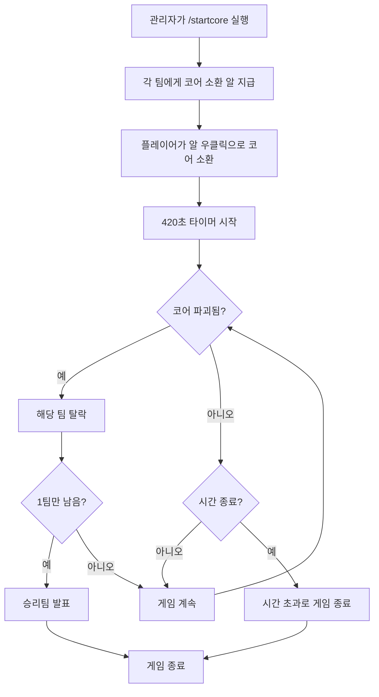
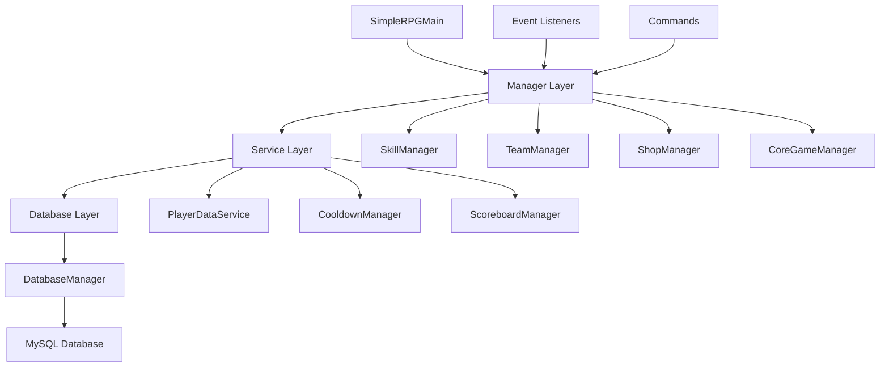

# 🎮 SimpleRPG Plugin (DP2Plugin)

[](https://papermc.io/)
[](https://openjdk.java.net/)
[](https://papermc.io/)
[](https://mysql.com/)

마인크래프트 Paper 서버를 위한 종합적인 RPG 플러그인입니다. 팀 기반 PvP, 독특한 스킬 시스템, 상점 NPC, 그리고 흥미진진한 코어전 게임모드를 제공합니다.

---

## 📚 목차

- [🎮 SimpleRPG Plugin (DP2Plugin)](#-simplerpg-plugin-dp2plugin)
  - [📚 목차](#-목차)
  - [✨ 주요 기능](#-주요-기능)
  - [🏗️ 프로젝트 구조](#️-프로젝트-구조)
  - [🛠️ 설치 및 설정](#️-설치-및-설정)
    - [요구사항](#요구사항)
    - [설치 과정](#설치-과정)
    - [데이터베이스 설정](#데이터베이스-설정)
  - [👥 팀 시스템](#-팀-시스템)
    - [팀 목록](#팀-목록)
    - [팀 가입/탈퇴](#팀-가입탈퇴)
    - [팀원 보호](#팀원-보호)
  - [⚔️ 스킬 시스템](#️-스킬-시스템)
    - [1. 🔥 버닝 스텝 (Burning Step)](#1--버닝-스텝-burning-step)
    - [2. 🏃 빤스런 (Pants Run)](#2--빤스런-pants-run)
    - [3. 🧊 크리스탈 프로텍션 (Crystal Protection)](#3--크리스탈-프로텍션-crystal-protection)
    - [4. 🪂 마법의 양탄자 (Flying Carpet)](#4--마법의-양탄자-flying-carpet)
    - [5. 💀 폭견 (Bomb Dog)](#5--폭견-bomb-dog)
    - [6. 💪 분노의 일격 (Rage Strike)](#6--분노의-일격-rage-strike)
  - [🏪 상점 시스템](#-상점-시스템)
    - [상점 위치](#상점-위치)
    - [1. 💰 화폐 교환소](#1--화폐-교환소)
    - [2. 📚 스킬북 상점](#2--스킬북-상점)
    - [3. 🧪 스킬 삭제 상점](#3--스킬-삭제-상점)
    - [보호구역](#보호구역)
  - [🏆 코어전 시스템](#-코어전-시스템)
    - [게임 진행](#게임-진행)
    - [코어 특성](#코어-특성)
    - [승리 조건](#승리-조건)
  - [⌨️ 명령어](#️-명령어)
    - [플레이어 명령어](#플레이어-명령어)
    - [관리자 명령어](#관리자-명령어)
  - [📊 데이터 관리](#-데이터-관리)
    - [데이터베이스 구조](#데이터베이스-구조)
    - [캐싱 시스템](#캐싱-시스템)
  - [🔧 개발자 정보](#-개발자-정보)
    - [아키텍처](#아키텍처)
    - [주요 클래스](#주요-클래스)
  - [🤝 기여 및 지원](#-기여-및-지원)

---

## ✨ 주요 기능

🎯 **핵심 시스템**
- 🏢 **팀 기반 게임플레이** - 4개 팀 (빨강/파랑/초록/노랑), 팀당 최대 2명
- ⚔️ **6가지 고유 스킬** - 각각 독특한 발동 방식과 효과
- 🏪 **상점 NPC 시스템** - 화폐 교환, 스킬 구매, 스킬 삭제
- 🏆 **코어전 게임모드** - 420초 생존 배틀
- 💾 **완전한 데이터 지속성** - 서버 재시작 시 모든 진행상황 복원

🔒 **보안 기능**
- 🛡️ **PDC 기반 아이템 검증** - 아이템 유변조 방지
- 🚫 **팀 PvP 차단** - 같은 팀원끼리 공격 불가
- 🏛️ **상점 보호구역** - 120블록 반경 그리핑 방지

---

## 🏗️ 프로젝트 구조

```
DP2Plugin/
├── 📄 pom.xml                          # Maven 프로젝트 설정
├── 📄 README.md                        # 프로젝트 문서
└── 📁 src/main/
    ├── 📁 java/com/febrie/dpp/
    │   ├── 🎯 SimpleRPGMain.java        # 메인 플러그인 클래스
    │   ├── 📁 command/                  # 명령어 처리
    │   │   ├── 👑 AdminCommand.java      # 관리자 명령어
    │   │   ├── 📖 SkillInfoCommand.java  # 스킬 정보 조회
    │   │   ├── 📋 SkillsCommand.java     # 보유 스킬 목록
    │   │   ├── 🚀 StartCoreCommand.java  # 코어전 시작
    │   │   └── 👥 TeamSelectCommand.java # 팀 선택
    │   ├── 📁 database/                 # 데이터베이스 계층
    │   │   └── 🗄️ DatabaseManager.java  # MySQL 연결 및 쿼리
    │   ├── 📁 dto/                      # 데이터 전송 객체
    │   │   ├── 🏰 CoreEntityData.java    # 코어 엔티티 정보
    │   │   ├── 🎮 CoreGameState.java     # 코어전 상태
    │   │   ├── ⏱️ PlayerCooldown.java    # 플레이어 쿨타임
    │   │   ├── 🧙 PlayerSkillState.java  # 플레이어 스킬 상태
    │   │   └── 👥 TeamData.java         # 팀 정보
    │   ├── 📁 listener/                 # 이벤트 리스너
    │   │   ├── 🏰 CoreGameListener.java  # 코어전 이벤트
    │   │   ├── ⚔️ PlayerSkillListener.java # 스킬 발동 이벤트
    │   │   ├── 👥 PlayerTeamListener.java # 팀 PvP 차단
    │   │   ├── 🔄 ServerLifecycleListener.java # 서버 생명주기
    │   │   └── 🏪 ShopInteractionListener.java # 상점 보호
    │   └── 📁 manager/                  # 비즈니스 로직 관리
    │       ├── ⏱️ CooldownManager.java   # 쿨타임 관리
    │       ├── 🏰 CoreGameManager.java   # 코어전 진행
    │       ├── 👤 PlayerDataService.java # 플레이어 데이터
    │       ├── 📊 ScoreboardManager.java # 스코어보드 관리
    │       ├── 🏪 ShopManager.java       # 상점 시스템
    │       ├── ⚔️ SkillManager.java      # 스킬 시스템
    │       └── 👥 TeamManager.java       # 팀 관리
    └── 📁 resources/
        ├── 📄 config.yml                # 플러그인 설정
        └── 📄 plugin.yml                # 플러그인 메타데이터
```

---

## 🛠️ 설치 및 설정

### 요구사항

- **Minecraft**: Paper 1.21.8
- **Java**: 24+
- **데이터베이스**: MySQL 8.0+
- **메모리**: 최소 2GB RAM 권장

### 설치 과정

1. **플러그인 다운로드**
   ```bash
   mvn clean package
   ```

2. **JAR 파일 복사**
   ```
   plugins/DP2Plugin-1.0-SNAPSHOT.jar
   ```

3. **서버 시작 후 설정**
   - 첫 시작 시 자동으로 `config.yml` 생성됨

### 데이터베이스 설정

`config.yml` 파일을 수정하세요:

```yaml
database:
  host: "localhost"
  port: 3306
  database: "simplerppg"
  username: "minecraft"
  password: "your_password"
```

---

## 👥 팀 시스템

### 팀 목록

| 팀 이름 | 색상 | 최대 인원 |
|---------|------|-----------|
| `red` | 🔴 빨간팀 | 2명 |
| `blue` | 🔵 파란팀 | 2명 |
| `green` | 🟢 초록팀 | 2명 |
| `yellow` | 🟡 노란팀 | 2명 |

### 팀 가입/탈퇴

```mcfunction
# 팀 가입
/teamselect red

# 다른 팀으로 이동 (자동으로 이전 팀에서 탈퇴)
/teamselect blue
```

### 팀원 보호

- ✅ **PvP 차단**: 같은 팀원끼리 데미지 불가
- ✅ **투사체 보호**: 화살, 눈덩이 등 투사체 데미지 차단
- ✅ **간접 데미지**: 스킬로 인한 데미지도 차단

---

## ⚔️ 스킬 시스템

플레이어는 총 6가지 스킬을 습득할 수 있으며, 각 스킬은 고유한 발동 방식과 효과를 가집니다.

### 1. 🔥 버닝 스텝 (Burning Step)

- **발동 방법**: 검 우클릭
- **효과**: 
  - 바라보는 방향으로 5블록 순간이동
  - 화염 저항 효과 5초 부여
  - 주변 몹에게 5 데미지
  - 화염 파티클 효과
- **쿨타임**: 8초

### 2. 🏃 빤스런 (Pants Run)

- **발동 방법**: 책에 좌표를 적고 던지기
- **사용법**: 
  ```
  책 내용에 "x y z" 형식으로 좌표 입력
  예: "100 64 -50"
  ```
- **효과**: 지정된 좌표로 즉시 텔레포트
- **쿨타임**: 30초

### 3. 🧊 크리스탈 프로텍션 (Crystal Protection)

- **발동 방법**: 방패 우클릭
- **효과**: 
  - 플레이어 중심 3×3×3 얼음 구체 생성
  - 중심은 물 블록
  - 5초 후 자동 제거
- **쿨타임**: 60초

### 4. 🪂 마법의 양탄자 (Flying Carpet)

- **발동 방법**: 마인카트 탑승
- **효과**: 
  - 바라보는 방향으로 부드러운 이동
  - config.yml에서 속도 조절 가능
  - 마인카트에서 내릴 때까지 지속
- **쿨타임**: 없음

### 5. 💀 폭견 (Bomb Dog)

- **발동 방법**: 뼈 던지기
- **효과**: 
  - 늑대 2마리 소환
  - 가장 가까운 적 플레이어 추적
  - 접촉 시 폭발 (폭발력 2.0)
  - 30초 후 자동 소멸
- **쿨타임**: 60초

### 6. 💪 분노의 일격 (Rage Strike)

- **발동 방법**: 패시브 (항상 활성)
- **효과**: 
  - 가상 레벨 10당 힘 I 효과 부여
  - 힘 I = 추가 데미지 5
  - 레벨업 시 자동 갱신
- **쿨타임**: 없음

---

## 🏪 상점 시스템

### 상점 위치

상점은 스폰 지점 (0, groundY, 0)을 기준으로 배치됩니다:


### 1. 💰 화폐 교환소

| 재료 | 수량 | 결과 |
|------|------|------|
| 💎 에메랄드 | 200개 | 🪙 화폐 1개 |
| 🔩 네더라이트 주괴 | 1개 | 🪙 화폐 1개 |
| 🍰 케이크 | 2개 | 📜 능력 삭제권 1개 |

### 2. 📚 스킬북 상점

| 스킬 | 가격 | 효과 |
|------|------|------|
| 🔥 버닝 스텝 | 🪙 화폐 10개 | 대시 + 화염저항 |
| 🏃 빤스런 | 🪙 화폐 10개 | 좌표 텔레포트 |
| 🧊 크리스탈 프로텍션 | 🪙 화폐 10개 | 얼음 구체 생성 |
| 🪂 마법의 양탄자 | 🪙 화폐 10개 | 마인카트 비행 |
| 💀 폭견 | 🪙 화폐 10개 | 폭탄 늑대 소환 |
| 💪 분노의 일격 | 🪙 화폐 10개 | 레벨 기반 힘 증가 |

### 3. 🧪 스킬 삭제 상점

| 스킬 삭제 포션 | 가격 |
|---------------|------|
| 🔥 버닝 스텝 삭제 | 📜 능력 삭제권 1개 |
| 🏃 빤스런 삭제 | 📜 능력 삭제권 2개 |
| 🧊 크리스탈 프로텍션 삭제 | 📜 능력 삭제권 2개 |
| 🪂 마법의 양탄자 삭제 | 📜 능력 삭제권 2개 |
| 💀 폭견 삭제 | 📜 능력 삭제권 2개 |
| 💪 분노의 일격 삭제 | 📜 능력 삭제권 1개 |

### 보호구역

- **반경**: 상점 중심 120블록
- **보호 내용**:
  - ❌ 블록 파괴 금지
  - ❌ 블록 설치 금지
  - ❌ 투사체 사용 금지
- **예외**: OP 권한 플레이어는 모든 제한 무시

---

## 🏆 코어전 시스템

### 게임 진행

1. **시작**: 관리자가 `/startcore` 명령어로 시작
2. **준비**: 각 팀에게 코어 소환 알 지급
3. **소환**: 플레이어가 알을 우클릭하여 코어(철골렘) 소환
4. **전투**: 420초 (7분) 동안 생존 배틀
5. **종료**: 마지막까지 코어를 보유한 팀 승리



### 코어 특성

- **외형**: 철골렘 (팀 색상 이름 표시)
- **이동**: 15초마다 반경 20블록 내 랜덤 위치로 텔레포트
- **능력**: 
  - 반경 30블록 내 적팀에게 구속 + 채굴피로 효과
  - 반경 30블록 내 모든 몹 제거
- **약점**: 물에 닿으면 즉시 파괴

### 승리 조건

1. **코어 생존**: 420초 동안 코어를 보호
2. **적팀 제거**: 모든 적팀의 코어 파괴
3. **보상**: 승리팀에게 다이아몬드 5개, 에메랄드 10개 지급

---

## ⌨️ 명령어

### 플레이어 명령어

| 명령어 | 설명 | 사용법 |
|--------|------|--------|
| `/teamselect` | 팀 선택/변경 | `/teamselect <red\|blue\|green\|yellow>` |
| `/skills` | 보유 스킬 목록 조회 | `/skills` |
| `/skillinfo` | 특정 스킬 정보 확인 | `/skillinfo <스킬명>` |

### 관리자 명령어

| 명령어 | 권한 | 설명 | 사용법 |
|--------|------|------|--------|
| `/startcore` | `simplerp.admin` | 코어전 시작 | `/startcore` |
| `/admin` | `simplerp.admin` | 플러그인 관리 | `/admin <reload>` |

**권한 정보**:
- `simplerp.admin`: OP 권한과 동일 (기본값: op)

---

## 📊 데이터 관리

### 데이터베이스 구조

```sql
-- 플레이어 스킬 상태
CREATE TABLE player_skills (
    player_id VARCHAR(36) PRIMARY KEY,
    player_name VARCHAR(16),
    burning_step BOOLEAN DEFAULT FALSE,
    pants_run BOOLEAN DEFAULT FALSE,
    crystal_protection BOOLEAN DEFAULT FALSE,
    flying_carpet BOOLEAN DEFAULT FALSE,
    rage_strike BOOLEAN DEFAULT FALSE,
    bomb_dog BOOLEAN DEFAULT FALSE,
    virtual_level INT DEFAULT 0,
    last_updated TIMESTAMP DEFAULT CURRENT_TIMESTAMP
);

-- 플레이어 쿨타임
CREATE TABLE player_cooldowns (
    player_id VARCHAR(36),
    skill_id VARCHAR(50),
    expire_time BIGINT,
    PRIMARY KEY (player_id, skill_id)
);

-- 팀 데이터
CREATE TABLE teams (
    team_name VARCHAR(20) PRIMARY KEY,
    members JSON,
    eliminated BOOLEAN DEFAULT FALSE,
    won BOOLEAN DEFAULT FALSE,
    created_time TIMESTAMP DEFAULT CURRENT_TIMESTAMP
);

-- 코어전 상태
CREATE TABLE core_game (
    id INT PRIMARY KEY AUTO_INCREMENT,
    active BOOLEAN DEFAULT FALSE,
    start_time BIGINT,
    end_time BIGINT,
    game_data JSON,
    created_at TIMESTAMP DEFAULT CURRENT_TIMESTAMP
);
```

### 캐싱 시스템

- **메모리 캐싱**: `ConcurrentHashMap` 기반 고성능 캐싱
- **자동 동기화**: 데이터 변경 시 즉시 MySQL 저장
- **서버 재시작 복원**: 모든 게임 상태 자동 복원
- **쿨타임 관리**: 만료된 쿨타임 자동 정리 (1분마다)

---

## 🔧 개발자 정보

### 아키텍처



### 주요 클래스

- **`SimpleRPGMain`**: 플러그인 진입점, 모든 매니저 초기화
- **`SkillManager`**: 6가지 스킬 시스템 관리
- **`TeamManager`**: 팀 생성/관리, PvP 차단
- **`CoreGameManager`**: 코어전 게임 로직
- **`ShopManager`**: 상점 NPC 및 보호구역 관리
- **`DatabaseManager`**: MySQL 연결 및 데이터 지속성
- **`PlayerDataService`**: 플레이어 데이터 캐싱 및 관리

---

## 🤝 기여 및 지원

### 개발자

- **Febrie** - 주 개발자
- **CoffeeTory** - 공동 개발자

### 버그 신고

이슈나 버그를 발견하시면 [GitHub Issues](https://github.com/Febriez/MyPage/issues)에 신고해주세요.

### 라이선스

이 프로젝트는 MIT 라이선스 하에 배포됩니다.

---

**📝 마지막 업데이트**: 2024년 1월  
**🎮 버전**: 1.0-SNAPSHOT  
**🔧 호환성**: Paper 1.21.8, Java 24+

---

> 💡 **팁**: 더 자세한 설정 방법이나 고급 기능에 대해서는 `config.yml` 파일의 주석을 참고하세요!